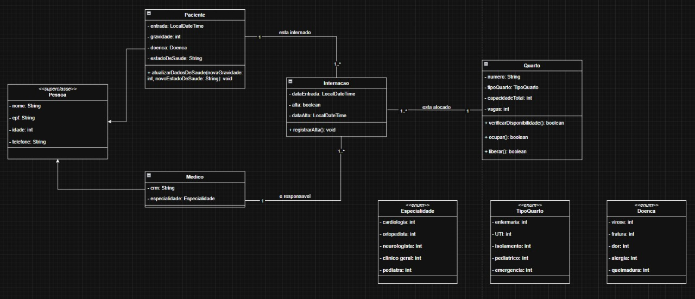

# 🏥Sistema de Gerenciamento Hospitalar
Este projeto é uma aplicação Java simples que simula o gerenciamento de um hospital. Ele implementa o cadastro e controle de médicos, pacientes, internações e quartos hospitalares, aplicando princípios de *Programação Orientada a Objetos (POO).*

#  📌 Funcionalidades
✅ Cadastro de médicos com especialidades 
✅ Listagem de médicos (todos ou filtrados por especialidade) 
✅ Registro de pacientes 
✅ Atualização de estado e/ou gravidade do paciente 
✅ Gerenciamento de internações hospitalares (incluir, dar alta) 
✅ Verificação e liberação de vagas em quartos 
✅ Listagem de quartos com vagas disponíveis 
✅ Consulta de todas as internações ou apenas as ativas 
✅ Menu Interativo com Entrada e Saída

# 📌 Diagrama de classes

