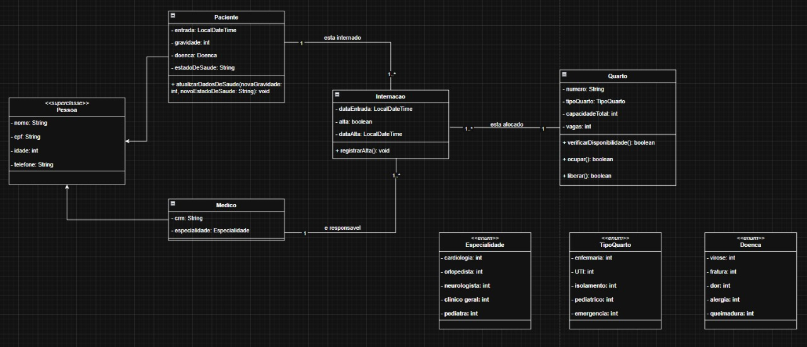

# 🏥Sistema de Gerenciamento Hospitalar
Este projeto é uma aplicação Java simples que simula o gerenciamento de um hospital. Ele implementa o cadastro e controle de médicos, pacientes, internações e quartos hospitalares, aplicando princípios de **Programação Orientada a Objetos (POO).**

#  📌 Funcionalidades
✅ Cadastro de médicos com especialidades 
✅ Listagem de médicos (todos ou filtrados por especialidade) 
✅ Registro de pacientes 
✅ Gerenciamento de internações hospitalares 
✅ Verificação de capacidade de quartos 
✅ Liberação de quartos no momento da alta 

# 📌 Diagrama de classes

